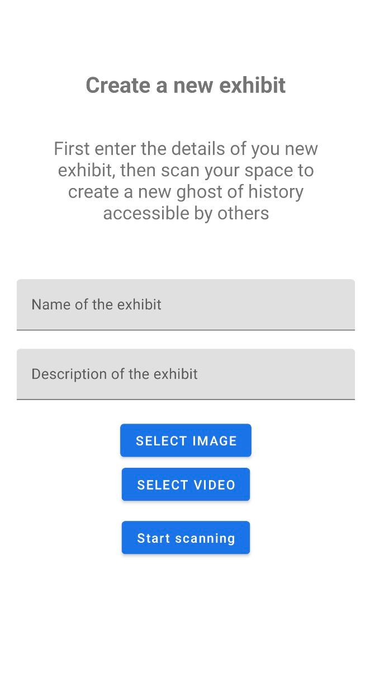
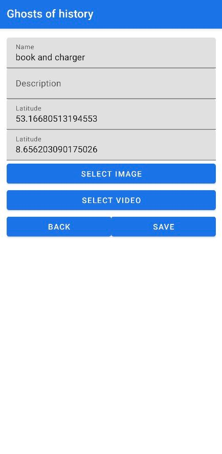
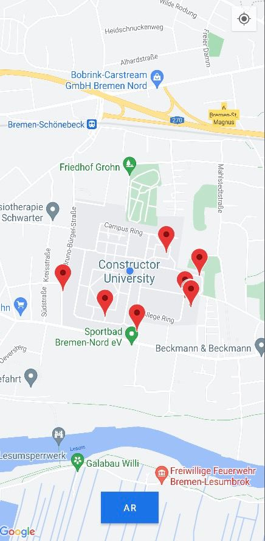
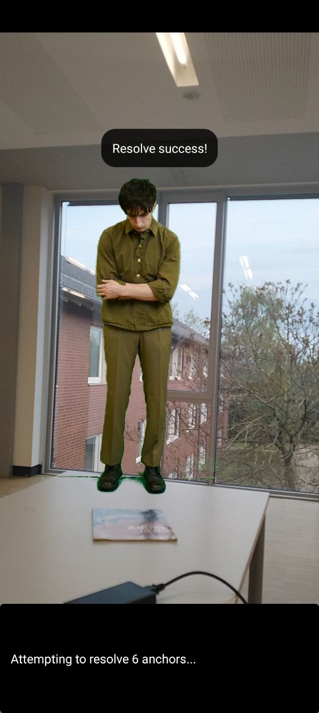

# Ghosts-of-History

''Ghosts of the History'' project has two interconnected apps. The first 
app is for moderators, allowing them to create and manage Augmented Reality (AR) 
exhibitions, while the second one is for users, enabling them to interact and 
engage with the exhibits. Moderators are people who can get full access of the 
exhibition, add new ones and change previously added.

	
## Moderator Application

The Moderator's App is designed to provide the functionality to add, 
configure, and manage the AR exhibits or ``Easter eggs''.

When the moderator enters the app, after the loading, he first comes 
to the Activity containing all points that are now available to the users. 

From the list of exhebits, all of them could be changed and modified, e.g. the name, description, image, video, its parameters, etc. To do so, one should click the particular cell of the collection and make changes in a freshly opened view:
	

	
The moderator can also quickly turn on/off visibility of the points to publicty. As well as add new exhibits by clicking on the ``+'' button in the bottom right corner. In such case a similar dialog to a previous one will be opened. 
	

## User Application

The User's App is designed to provide an immersive AR experience, enabling users to interact and engage with the exhibits.

When a user launches the app, they are greeted with a map that shows all the available AR points or exhibits around their current location.

On this map, each AR point is represented by a marker. These markers can change color depending on the user's interaction - for example, markers may turn green once a user has watched the video associated with the point.

Users can click on these markers to reveal more information about the exhibit. This could include the name, a brief description, and an option to start the AR experience.

To start the AR experience, users simply click on the 'Start AR' button. The app will then use the device's camera to overlay the AR exhibit onto the user's real-world view.

This unique feature of the app provides an engaging and interactive way for users to learn about history, explore new places, and find hidden 'Easter eggs' within their surroundings.

The User's App is simple, intuitive, and designed with the user's convenience in mind. It allows them to explore history in an immersive, interactive, and fun way - truly bringing the 'Ghosts of the History' to life!

